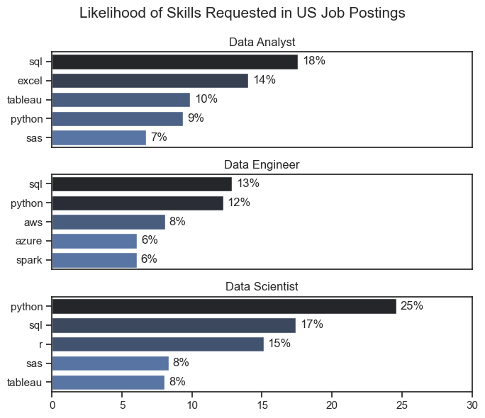
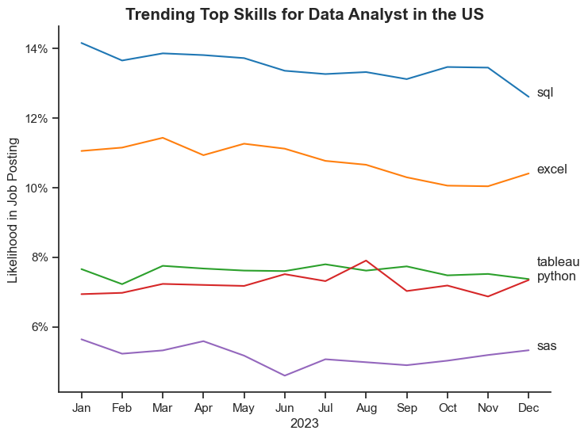
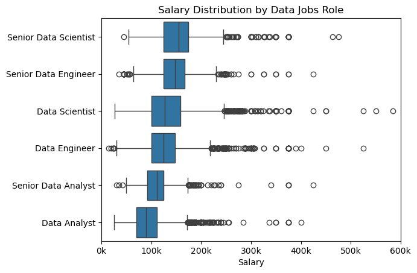
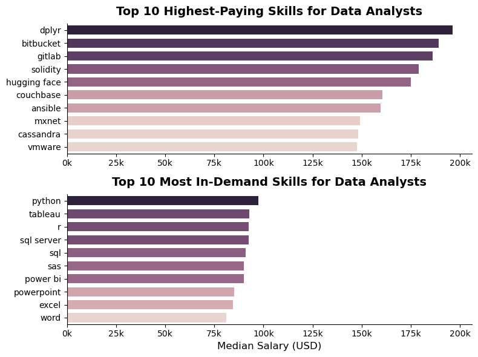
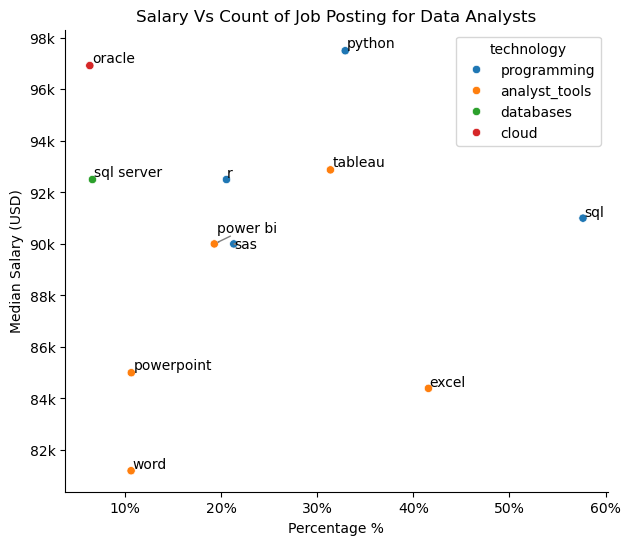

# Overview

Welcome to my analysis of the data job market, focusing on Data Analyst roles. This project was created to navigate and understand the job market more effectively — digging into the top-paying and most in-demand skills to help identify the best opportunities for data analysts.

The data is sourced from [Luke Barousse's Python Course](https://youtu.be/wUSDVGivd-8?si=1FqxBBEcewI1MXnB), which provides detailed information on job titles, salaries, locations, and required skills. Through a series of Python scripts, I explore key questions such as the most demanded skills, salary trends, and the intersection of demand and pay in data analytics.

# The Questions

Below are the questions I set out to answer in this project:

1. What are the skills most in demand for the top 3 most popular data roles?
2. How are in-demand skills trending for Data Analysts?
3. How well do jobs and skills pay for Data Analysts?
4. What are the optimal skills for data analysts to learn? (High Demand AND High Paying)

## Background

This project was driven by a desire to better understand the data analyst job market — figuring out which skills are worth prioritizing based on both demand and pay, rather than guessing. It's also part of my broader journey toward landing a Data Analyst role.

# Tools Used

For this deep dive into the data analyst job market, I used several key tools:

- **Python**: The backbone of my analysis, letting me process the data and find critical insights. I also used the following Python libraries:
  - **Pandas Library:** Used to analyze and manipulate the data.
  - **Matplotlib Library:** Used to visualize the data.
  - **Seaborn Library:** Helped create more advanced and polished visuals.

- **Jupyter Notebooks:** Used to run my Python scripts, making it easy to include notes and analysis alongside the code.
- **Visual Studio Code:** My go-to editor for writing and executing scripts.
- **Git & GitHub:** Used for version control and sharing my code and analysis, ensuring project tracking and collaboration.

# The Analysis

## 1. What are the most demanded skills for the top 3 most popular data roles?

To find the most demanded skills for the top 3 most popular data roles. I filtered out those positions by which ones were the most popular, and got the top 5 skills for these top 3 roles. This query highlighted the most popular job titles and their top skills, showing which skills I should pay attention to depending on the role I'm targeting.

View my notebook with detailed steps here: [2_Skill_Demand.ipynb](3_Project\2_Skill_Demand.ipynb)

### Visualize Data
``` python
fig ,ax = plt.subplots(3,1,figsize=(7,6))

sns.set_theme(style='ticks')
for i,title in enumerate(job_titles):
    df_plot1 = df_skill_perc[df_skill_perc['job_title_short']==title].head(5)
    #df_plot1.plot(kind='barh',x='job_skills',y='percentage',ax=ax[i],title=title)
    
    sns.barplot(data=df_plot1,x='percentage',y='job_skills',ax=ax[i],hue='percentage',palette='dark:b_r')
    ax[i].set_title(title)
    ax[i].set_xlim(0,30)
    ax[i].legend().remove()
    #ax[i].invert_yaxis()
    ax[i].set_ylabel('')
    ax[i].set_xlabel('')

    for n,v in enumerate(df_plot1['percentage']):
        ax[i].text(v+0.3, n , f'{v:.0f}%',va='center')

    if i != len(job_titles)-1:
        ax[i].set_xticks([])

fig.suptitle('Likelihood of Skills Requested in US Job Postings', fontsize=15)
fig.tight_layout()
plt.show()
```
### Results


### Insights

### Skills Analysis: Data Analyst vs Engineer vs Scientist

- **SQL and Python are the shared foundation across all three roles** — SQL ranks in the top two skills everywhere (Analyst 18%, Engineer 13%, Scientist 17%), while Python's importance scales sharply from a minor skill for Analysts to the dominant skill for Scientists (25%, by far the highest of any single skill across all roles).

- **Each role layers distinct specialized skills on top of that baseline:** 
  - Data Analysts add Excel (14%) and Tableau (10%) for reporting and dashboards; 
  - Data Engineers add AWS (8%), Azure (6%), and Spark (6%) for cloud infrastructure and pipelines; 
  - Data Scientists add R (15%) for statistical modeling alongside their heavy Python use.

- **Career path implication:** building SQL + Python first, then layering role-specific tools (BI tools, cloud platforms, or R/stats depending on direction), is the most efficient route into a specialized data career.

## 2. How are in-demand skills trending for Data Analysts?

View my notebook with detailed steps here: [3_Skill_Trend.ipynb](3_Project\3_Skill_Trend.ipynb)

### Visualize Data

```python
plt.figure(figsize=(8,6))
sns.lineplot(data=df_plot,dashes=False,palette='tab10')
sns.set_theme(style='ticks')
sns.despine()

plt.title('Trending Top Skills for Data Analyst in the US',fontsize=15,fontweight='bold')
plt.xlabel('2023')
plt.ylabel('Likelihood in Job Posting')
plt.legend().remove()

axis = plt.gca()
axis.yaxis.set_major_formatter(PercentFormatter(decimals=0))

for i in range(5):
    plt.text(11.2, y_positions[i], df_plot.columns[i])
```

### Results


*Bar graph visualizing the trending top skills for data analysts in the US in 2023.*

### Insights
- SQL stays the top skill all year, though it shows a gentle decline in demand from January toward December.
- Excel holds steady in second place, dipping through the middle months before climbing back up toward the end of the year, moving ahead of both Python and Tableau again by December.
- Python and Tableau move closely together for most of the year, rising and falling in similar patterns, with Python briefly pulling ahead around mid-year before the two settle close together again.
- SAS stays the weakest performer throughout, showing no real growth and finishing the year close to where it started.

## 3. How well do jobs and skills pay for Data Analysts?

View my notebook with detailed steps here: [4_Salary_Analysis.ipynb](3_Project\4_Salary_Analysis.ipynb)

### Visualize Data

```python
plt.figure(figsize=(10, 6))

sns.boxplot(data=df_top_6,x='salary_year_avg',y='job_title_short',order=job_orders)
plt.ylabel('')
plt.xlabel('Salary')
plt.title('Salary Distribution by Data Jobs Role')
ax = plt.gca()
ax.xaxis.set_major_formatter(plt.FuncFormatter(lambda x,pos : f'{int(x/1000)}k'))
plt.xlim(0,600000)
plt.show()
```

### Results 



### Insights 
- Seniority and role type both raise pay, but role type matters more. Every "Senior" version shows higher median salary than its base role, but the jump from Data Analyst to Data Engineer/Scientist is a much bigger leap than the jump from Data Analyst to Senior Data Analyst — suggesting switching roles pays off more than staying and waiting for seniority.
- Data Analyst has the tightest, lowest range of all six roles, with medians and spreads clearly below every other role — including Senior Data Analyst, which still trails behind base-level Data Engineer and Data Scientist.
- Data Scientist and Senior Data Scientist show the widest spread and the most extreme high-end outliers, stretching well past 500k — meaning while typical pay is comparable to Data Engineer roles, the ceiling for exceptional pay is highest in the Data Scientist track.

## Highest Paid & Most In-Demand Skills for Data Analysts

### Visualize Data
```python
top_pay_series = top_pay['median']
top_skills_series = top_skills['median']

top_list =[top_pay_series,top_skills_series]
titles = [
    "Top 10 Highest-Paying Skills for Data Analysts",
    "Top 10 Most In-Demand Skills for Data Analysts"
]

fig, ax = plt.subplots(2,1,figsize=(8,6))

for i,(data,title) in enumerate(zip(top_list,titles)):
    sns.barplot(
        y=data.index,
        x=data.values,
        ax=ax[i],
        hue=data.values,
        width=0.7
            )
        
    ax[i].set_title(title, fontsize=14, fontweight='bold', pad=10)
    ax[i].set_ylabel('')
    ax[i].set_xlabel('')
    ax[i].legend().remove()
    ax[i].xaxis.set_major_formatter(FuncFormatter(lambda x, pos: f'{int(x/1000)}k'))

    ax[1].set_xlim(ax[0].get_xlim())
    ax[1].set_xlabel('Median Salary (USD)',fontsize=12)
                   
    sns.despine()
    
plt.tight_layout()
plt.show()
```

### Results


### Insights 
- The highest-paying skills and the most in-demand skills are almost completely different lists — none of the top 10 highest-paying skills (dplyr, bitbucket, gitlab, solidity, hugging face...) overlap with the top 10 most in-demand ones (python, tableau, r, sql, sas...). Being in-demand doesn't mean being well-paid for a Data Analyst.
- The highest-paying skills are niche, developer/engineering-adjacent tools (Bitbucket, GitLab, Ansible, Cassandra, Hugging Face) rather than typical analyst tools — suggesting the pay premium goes to analysts who cross over into engineering/dev-adjacent work, not to deeper analytics work itself.
- The most in-demand skills top out much lower in pay than the top-paying ones — even Python, the single most requested skill, sits around 100k, well below every skill in the top-paying chart. This means chasing raw demand and chasing high pay are two different strategies, and the truly common, expected skills (Excel, Word, PowerPoint) are both the most in-demand and the lowest-paying of the group.

## 4. What is the most optimal skill to learn for Data Analysts?

View my notebook with detailed steps here: [5_Optimal_Skills.ipynb](3_Project\5_Optimal_Skills.ipynb)

### Visualize Data 
```python 
plt.figure(figsize=(7,6))
sns.scatterplot(data=df_DA_skills_high_demand,x='skill_percent',y='median_salary',hue='technology')
sns.despine()

plt.ylabel('Median Salary (USD)')
plt.xlabel('Percentage %')
plt.title('Salary Vs Count of Job Posting for Data Analysts')

ax = plt.gca()
ax.xaxis.set_major_formatter(PercentFormatter(decimals=0))
ax.yaxis.set_major_formatter(plt.FuncFormatter(lambda y,pos:f'{int(y/1000)}k'))

text=[]
for i,txt in enumerate(df_DA_skills_high_demand['skills']):
    text.append(plt.text(df_DA_skills_high_demand['skill_percent'].iloc[i],df_DA_skills_high_demand['median_salary'].iloc[i],txt))

adjust_text(text,arrowprops=dict(arrowstyle='->',color='grey',lw=1))

plt.show()
```

### Results 

*A scatter plot visualizing the most optimal skills (high-paying & high-demand) for data analysts in the US.*

### Insights 
- Python and SQL are the clear standouts — Python leads on salary while also holding strong demand, and SQL has by far the highest demand while still paying well. Everything else trades off one for the other.
- Excel and Word show high demand but weak pay — they're expected, baseline skills that nearly every posting asks for, not skills that boost your salary.
- Rare skills can still pay well — Oracle has the lowest demand of the group by a wide margin, yet its pay sits near the top, showing that being uncommon doesn't always mean being low-value.

# What I Learned

Throughout this project, I deepened my understanding of the data analyst job market and strengthened my technical skills in Python, especially around data manipulation and visualization. A few specific things I learned:

- **Advanced Python Usage:** Using libraries like Pandas for data manipulation and Seaborn/Matplotlib for visualization helped me perform more complex analysis efficiently.
- **Data Cleaning Importance:** Thorough data cleaning and preparation is essential before any analysis — it directly affects the accuracy of the insights drawn from it.
- **Strategic Skill Analysis:** The project reinforced how important it is to align your own skills with market demand — understanding the relationship between demand, salary, and job availability enables more strategic career planning.

# Insights

This project surfaced several general insights into the data analyst job market:

- **Skill Demand and Salary Correlation:** There's a clear pattern between how in-demand a skill is and what it pays — though not always in the direction you'd expect. Some niche, less-common skills command a premium, while some of the most in-demand skills (like Excel) pay comparatively less.
- **Market Trends:** Skill demand shifts over the year rather than staying static — staying aware of these trends matters for long-term career growth in data analytics.
- **Economic Value of Skills:** Understanding which skills are both in-demand and well-paying helps prioritize learning in a way that maximizes career return, rather than chasing demand or pay alone.

# Challenges I Faced

This project came with a few real challenges, each a good learning opportunity:

- **Data Inconsistencies:** Handling missing or inconsistent data entries required careful cleaning to preserve the integrity of the analysis.
- **Complex Data Visualization:** Designing charts that conveyed insights clearly — without becoming cluttered — took real iteration and thought.
- **Balancing Breadth and Depth:** Deciding how deeply to explore each question while still covering the full scope of the analysis required constant balancing.

# Conclusion

This exploration into the data analyst job market has been genuinely informative, surfacing the skills and trends that shape this evolving field. The insights gathered here sharpened my own understanding and offer practical guidance for anyone looking to grow their career in data analytics. As the market keeps evolving, continued analysis will be key to staying ahead — this project is a solid foundation for future exploration and reinforces the value of continuous learning in the data field.
